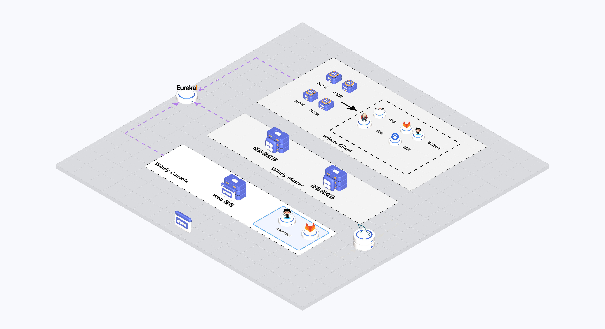

# **Windy**

Windy是一款轻量级Devops平台工具,支持服务代码变更管理，代码部署、用例编写、代码测试、流水线扩展等特性。使用Windy你可以在最简化的资源的情况下，保证业务功能的正确性以及延续性(多次迭代的情况下，依然可以保证历史业务不受影响)。简单来说，windy覆盖了日常开发的整个生命周期，从代码构建、部署、测试、发布、上线都支持。

## 系统初始化
请参考使用文档完成系统初始化,主要完成系统配置即可, 详细内容请参考： [Windy使用文档](https://github.com/zhijianfree/Windy/wiki/Windy-%E4%BD%BF%E7%94%A8%E6%96%87%E6%A1%A3)

## 系统介绍视频
系统使用介绍视频列表: [前往B站查看视频](https://b23.tv/VfmGbSO)
视频中介绍以下操作部署
- Windy安装全过程
- 初始化
- 自动化用例使用
- 部署环境管理
- 流水线
- API管理
- 需求/缺陷管理

## 快速开始
### 1 导数据库sql
如果没有数据库可先通过docker下载并安装:
```shell
docker pull mysql:5.7

docker run --env=MYSQL_ROOT_PASSWORD=123456 -p 3306:3306 --name mysql5.7 -d mysql:5.7
```
数据库准备好后，先创建数据库名称为:**windy**, 然后下载并导入sql文件:
[windy.sql](https://github.com/zhijianfree/Windy/blob/master/windy-starter/src/main/resources/sql/windy.sql)

### 2 启动Windy服务

启动Windy支持docker和jar两种方式:

> 使用Docker安装
```shell
curl -sSL https://github.com/languyue/Windy/raw/master/shell/docker_start.sh \
  | bash -s \
  数据库IP:数据库端口 \
  数据库用户 \
  数据库用户密码
```
> 使用jar部署

请前往 [Windy发布页](https://github.com/languyue/Windy/releases) 下载需要的版本。

```shell
#解压后进入windy目录，下面以1.0.0版本为例:
cd windy-1.0.0

./start.sh 数据库IP:数据库端口 数据库用户 数据库用户密码
```

### 3 用浏览器打开console
```
http://主机IP:9768
```
在浏览器中输入地址即可访问Windy，默认用户名/密码: windy/admin


## 已支持功能
- 服务管理：
  - 服务配置管理，以及支持对接不同git平台(Github、gitlab、gitea)
  - api管理：管理业务所有的api、支持api生成二方包(jar)、支持第三方文件导入(postman、yapi)
- 流水线管理：
  - 支持变更分支管理: 代码分支可关联需求与缺陷，支持代码分支级别溯源。
  - 流水线:
    - 流水线默认集成了代码构建、人工审核、自动化用例、代码合并、代码部署等节点支撑研发质量功能。
    - 支持三种不同的流水线，根据实际情况使用: 自定义流水线(日常开发使用)，定时流水线(长运环境测试)、代码发布流水线(开发分支合入Master的功能)
  - 自定义流水线节点: 除了默认节点外，Windy流水线还支持通过HTTP的方式集成公司内部系统任务提高很大的扩展性，如果集成现有jenkins、触发内部的邮件服务等。
- 自动化用例管理：
  - 基于UI编排模版完成自动化测试，降低使用测试门槛和成本
  - 除常规Rest接口功能测试外，还可支持自定义插件完成中间件(mysql、redis、http、kafka等)数据校验
  - 支持服务级别用例以及e2e(端到端)的测试方式
  - 支持统一套测试用例覆盖不同的环境
- 需求缺陷管理：支持创建需求、缺陷以及迭代。
- 支持SSH和Kubernetes部署
- 研发工具插件开发：提供研发工具(Idea、Vscode)的插件，面向开发者更友好。

## 未来计划
- 支持api审核机制、支持api生成文档
- 生态集成:
    - 消息通知: 对接三方系统消息通知机制(企业微信、钉钉、飞书等)
    - 三方系统对接: 对接阐道、JIRA、PingCode等api，将三方系统数据同步至Windy中。
    - 代码检查、以及覆盖率校验等
- 指标体系：支持需求、缺陷、研发、测试全流程数字指标建设，完成研发体系可视化，能够查看需求从创建到实现完成的整个生命周期数据
- 战略规划：通过研发体系数据化能力，将组织战略拆分细化能全局查看战略落地情况
- AI建设:
    - 通过AI分析研发体系数据，提供优化研发效率手段、梳理研发流程阻塞点等
    - AI自动添加测试用例

## 架构设计


## 加群交流


