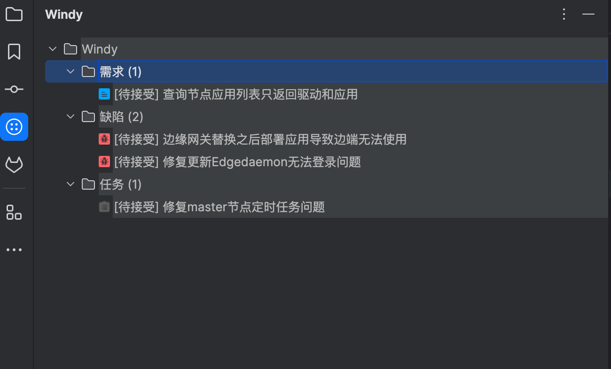
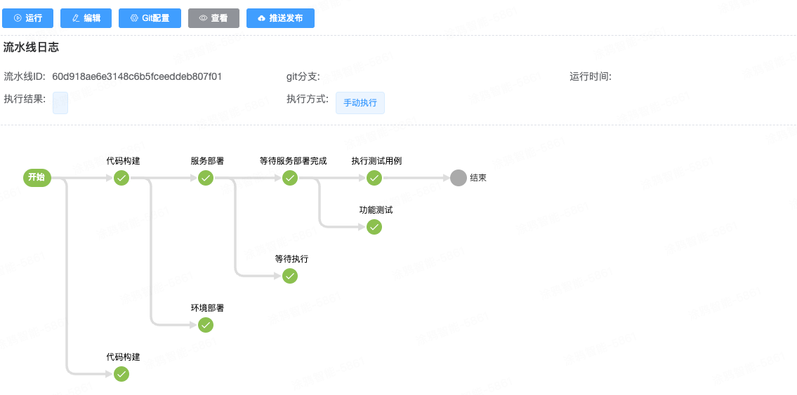
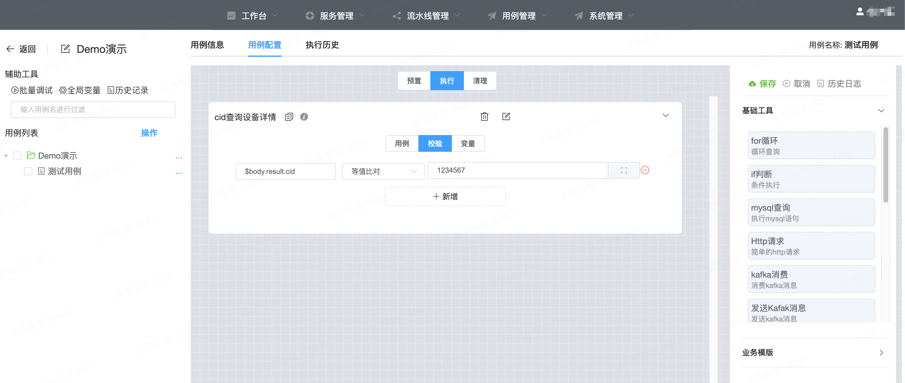
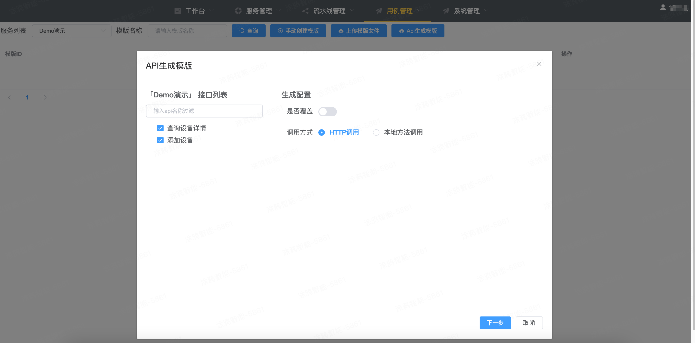
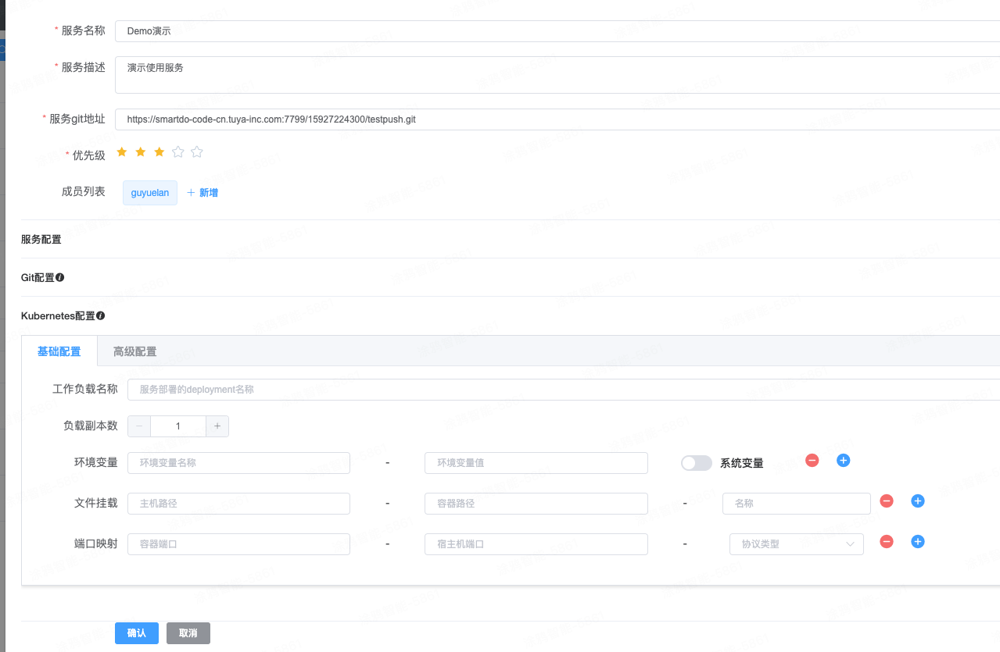

# **Windy**

## 1. 整体设计
### 介绍
Windy在设计之初是为了实现开发过程中研发质量的保证以及研发过程一体化的可视、可度量的目标，所以Windy的功能模块都是根据需求的生命周期来设计的，从需求的创建、开发、测试、发布都可以在Windy一个工具平台无缝衔接使用。

Windy在架构上分为三个部分：Console、Master、Client。Console服务负责创建和整理所有任务的元数据，然后由Master节点负责调度任务以及分发给Client，Client来实现任务的执行。其中在Client的设计上提出了"零依赖"的想法，也就是说Client除了依赖jdk之外其他任何组件都不依赖，任意的一台linux服务器都可直接运行，这个设计大大提高了Client节点的适配性。并且在Windy的整体使用设计上，也是只依赖Mysql一个中间组件，也减少了整个工具使用的复杂度。

架构图如下：


在现有的设计模式下Console、Master、Client是基于注册中心Eureka来相互发现的，所以可以根据自己业务的体量动态调整模块的实例个数。并且在UI交互与后端任务执行解偶的场景下，调整的过程是不会影响到正在使用的业务。

### Windy-Console
Windy-Console就是页面的API服务完成所有模块数据的创建与维护，其实在Windy的使用过程中，用户大部分时间是在Console中完成。在Console中完成服务的创建、API的管理、流水线的创建、用例的维护、模版的创建、以及环境管理等功能。
### Windy-Master
Master节点主要负责所有任务功能的调度，由于Client的设计是不依赖任何中间件组件(也包括不依赖mysql)，所以任务的所有数据都要从Master节点组装完成之后CLient才可执行。
其中master节点除了接收来自console触发的任务之外，还会执行定时的任务，比如定时的流水线以及调度重建任务。

其中重建任务是指，在Master正常调度过程中服务突然崩溃导致任务丢失的场景，每当Master节点重新启动或者1小时间隔扫描都会检测是否存在重建任务，发现重建任务就会触发任务重新执行。

### Windy-Client

Client时windy的所有任务的实际执行者，其中处理任务所需要的数据都来自于master节点。Client支持的任务如下：
- 流水线执行
 - 代码构建： 支持从git地址拉取代码然后构建代码产物，目前支持Java、Go语言。
 - 代码部署：根据构建的产物，部署到对应的环境中，支持K8S部署以及远程SSH部署。
 - 人工审批：，在开发分支需要发布到主分支时通过审批后才可执行，一般在发布流水线中使用
 - 触发用例任务：在流水线构建分支代码之后，可以关联执行服务的测试用例保证代码质量。
 - 代码合并：将开发分支合并到主分支中
- 用例任务执行：执行在测试集中编写的单个用例
- 任务执行： 执行负载任务管理中绑定的任务列表
- API二方包生成： 根据服务的API列表生成二方包，业务根据二方包来开发业务，当需要变更API时就需要重新生成二方包，进而可以长期维护API信息与代码的一致性。并且在后面的迭代中添加审核机制，可以更好的管理API的质量。


## 2. 功能模块
### 2.1 需求与缺陷
#### 2.1.1 空间
所有的需求与缺陷都是以空间维度隔离，在空间中支持迭代的形式来关联具体的开发阶段。在迭代中可以单独维护需求与缺陷，这样在实际业务中可以更新的区分不同的业务场景。

#### 2.1.2 个人工作台
个人工作台可以更加便捷查看和处理开发者所负责的缺陷与需求，除此之外还提供了工作项功能。在一些代码优化或者架构调整等场景下，可能是有开发者自主发起时使用，这样开发的内容也可维护在Windy平台内。

在工作台中可以直观查看自己的负责任务进度与详情，同时Windy也提供了个人工作台Idea插件功能查看个人任务信息。 使用插件可以沉浸式开发代码无需到页面中维续需求与缺陷状态。




### 2.2 服务管理
#### 2.2.1 服务列表
Windy的所有功能使用的前提基础都是需要将服务的git信息、构建信息、镜像信息录入到Windy中。服务的录入需要有下面几个点需要注意：
- 服务Git地址：此处需要录入服务的Git的url地址，改地址必须是真实有效的，否则服务创建时会校验不通过。校验Git地址是否有效，是通过在系统配置的Git的token访问git地址来保证。
- 服务配置
 - 部署方式：目前服务部署只支持kubernestes、SSH部署(通过将jar包推送到对应环境)
 - 开发语言：开发语言目前只支持Java与Go语言
 - 构建版本：代码构建时所需要的构建工具版本，Windy内置了Maven的3.3.8版本，Go语言版本1.20
- Git配置：正常情况下团队内的git地址应该都是使用相同的git配置信息即在系统配置中统一配置git访问的token就可。但是在一些特殊情况下，有些服务地址是单独的git地址时，可以使用此配置单独当前服务的git信息。

#### 2.2.2 API管理
服务的接口功能在Windy上统一维护，服务相关开发者都可查看服务的API信息。
目前API支持从下面的平台中导入到Windy中：
- Postman
- Yapi

Windy还提供了API的二方包生成功能，支持将API转化成Java二方包。业务开发者通过集成二方包的形式来开发业务接口，这样API的与业务代码强关联完成接口功能的一致性。

**API审核**
一般服务对外提供的功能都是通过API来实现的，所以API的维护某种程度上和服务的质量是关联的。代码的变更和设计的合理性需要根据引入审核制度，这样可以避免API泛滥和设计不合理的问题。

### 流水线
流水线的概念是比较熟悉的，Windy支持在流水线中添加各个执行节点，除了常规的执行节点之外，还支持动态添加执行节点（通过HTTP调用的方式集成）。
流水线分为下面三种类型：
- 自定义流水线： 可以根据开发者的需求任务组合配置流水线节点的内容。
- 定时流水线： 通过配置时间每天定时执行流水线，可用于日志功能测试，或者分支稳定性功能测试
- 发布流水线： 当开发代码完成之后，需要将开发分支代码何如到主干分支时使用。在自定义分支中通过推送发布按钮将开发分支推送到发布流水线。

创建流水线时，可以集成测试用例这样可以在每次流水线执行之后都对当前分支代码进行一次功能测试。



### 测试用例
服务功能质量需要测试人员通过功能测试来看护，但是每次代码变更都需要人工做全量测试成本比较高，尤其在产品化团队迭代很久时做全量回归测试成本会更高，从成本的角度上看大部分团队只会选择增量功能测试。如果选择增量测试，那么每次代码变更、迭代新需求是否会影响历史功能就很难保证。

Windy提供在线测试用例编写功能，支持服务接口功能全自动化执行可减少全量测试带来的成本。Windy提供了**全UI编写用例的功能**只需要在web界面上拖拽即可完成用例编写，并且除了测试HTTP接口外还可拖拽其他类型请求，比如：Mysql查询、kafka消息订阅/发布、Redis操作、支持JS语法(ES5)等，如果现有插件不满足业务还可开发自定义插件Jar包完成业务功能测试，自定义插件开发引入plugin的maven依赖即可：
```
<dependency>
    <artifactId>windy-plugin</artifactId>
    <groupId>com.zj</groupId>
    <version>1.0.1</version>
</dependency>
```
##### 用例编写
用例编写UI分为三个部分，左侧可管理用例信息，中间为用户编写区域，右侧为拖拽模版区域。在左侧创建完用例之后可在右侧将API模版拖拽至用例编写区，根据业务场景拖拽完所需的模版之后保存整个用例之后即可测试运行。

###### 全局变量

用例编写过程中需存在相同变量数据比如接口请求的token，可以在全量变量中定义，然后在用例中引用即可。

###### 用例组成
一个用例的声明周期被定义为：预制、执行、清理。
- 预制： 在实际业务场景中，用例执行之前需要做一些上下文的准备工作才可顺利执行，所以需要预制阶段准备好测试验证的所有前置数据
- 执行： 执行测试用功能。
- 清理：预置、执行阶段自动化长期运行过程中会产生脏数据，为了避免影响测试环境，需要每个用例在执行完成之后清理脏数据。

拖拽完用例之后会在UI上看到三个title信息:
- 用例： 此处用来填写用例的实际信息
- 断言： 可以根据用例执行之后的结果判断用例执行是否成功。
- 变量：一般来说用例会包含多个拖拽的API模版（拖拽之后统称为**执行点**，后面统一用执行点来代表），后执行的执行点可能会需要前置执行点的返回结果，所以可以在前置执行点中定义好变量，后置执行点就可引用。

###### 变量语法
**用例变量**

通过"${}"包裹变量的方式可引入上下文变量**${变量名}**，比如全局变量中定义了name变量，在执行点中使用"${name}"就可直接引用，局部变量使用方式一样。

**断言变量**
断言变量有个默认变量"$body",这个变量无需定义默认代码用例执行的结果。比如查询设备接口返回下面的信息:
```
{
  "result": {
    "extend": "",
    "connected": 0,
    "name": "eeee",
    "description": "eeee",
    "cid": "1234567"
  },
  "t": 1733047610592,
  "success": true
}
```
那么$body就代表整个json结构体，所以可以通过$body.result.cid直接获取到响应数据的cid信息然后设置期望值即可判断，实例如下:



**断言运算符**
目前支持的运算符如下:
- 等值比对：比较数据内容，比较值是否相等，可以理解为java的Equal，直接根据字符串内容比对
- 值不为空： 值内容不为null
- 数组内容匹配： 在对象数组中遍历列表找到满足条件的数据，通过指定对象属性Key找到对应的值与期望值比对
- 数组内容不匹配：与内容匹配相反
- 枚举匹配：判断返回值是否在期望的枚举列表中，枚举列表通过逗号隔开
- json对象比对： 按照json格式比对，响应的json内容要满足期望值的所有字段，但是实际值可以返回多于期望值的结构体。
- json数组比对：json数组比对，比对的方式同json比对
- 等于： 数值比对，下面的操作符类似，不再赘述。
- 大于
- 大于等于
- 小于
- 小于等于


##### 用例模版
用例中通过拖拽API模版来创建执行点完成整个用例的编写即可测试服务的API功能，那么模版是如何关联API的？

**API模版**
在Windy的模版管理模块中，可以基于服务的API动态生成API模版功能，生成模版后只需要对于接口功能的测试只需要配置部分参数变量即可，需要关心用例的执行简化了用例执行的复杂度。



> 如果API相同那么需要选择"覆盖"现有用例的按钮，默认情况下是使用HTTP调用API，如果业务场景下无法直接使用rest接口需要做一些前置处理，可以选择本地方法作为关联模版，这样在每次执行模版时会优先执行关联模版，然后再调用HTTP信息。

**自定义模版**

有的场景下访问一下接口不是来自于当前服务，可以通过手动创建模版的方式调用对应HTTP接口。

**插件模版**

当业务场景比较复杂的时候，除了HTTP请求之外还需要发起其他类型的请求，比如MQTT、Dubbo、Mongo等。 可以考虑自定义开发插件的方式实现业务场景，插件的开发可参考GitHub模版
[自定义模版插件样例](https://github.com/zhijianfree/template-plugin-demo)

##### 用例任务管理
测试用例编写完成之后可以创建一个任务来关联，在用例编写阶段使用的环境可能是开发等非正式环境，但是最终要落地到实际生产环境中。创建任务时可以根据所运行环境的信息维护全局变量，这样统一套用例可在不同的环境中测试运行。

同样测试任务也可集成到流水线中，在每次构建代码之后都执行一次用例任务，确保代码功能的正确性。
### 环境管理
代码部署关联的环境分为两种：远程SSH部署、Kubernestes部署。
**SSH部署**

创建SSH部署环境时需要配置好远程服务器访问的用户与密码以及操作指定目录下的权限，在代码构建完成之后会将构建产物推送到远程服务器然后启动执行。

**Kubernestes部署**

Kubernestes部署需要填写必要的访问K8S的token信息以及命名空间，并且需要具备访问Deployment的所有操作权限，否则在部署时会失败。
其中部署的Deployment信息在服务管理中维护。



# 3.未来规划
## 生态对接
- 对接代码检查工具，比如静态代码扫描、增量代码扫描
- 对接阐道、JIRA、PingCode等api，将三方系统数据同步至Windy中。
- 消息通知: 对接三方系统消息通知机制(企业微信、钉钉、飞书等)

## 研发体系数字化
指标体系：支持需求、缺陷、研发、测试全流程数字指标建设，完成研发体系可视化，能够查看需求从创建到实现完成的整个生命周期数据
### 战略目标落地可视化
通过研发体系数据化能力，将组织战略拆分细化能全局查看战略落地情况

### AI建设
通过AI分析研发体系数据，提供优化研发效率手段、梳理研发流程阻塞点等
AI自动添加测试用例

## OPS整合接入
通过引入监控体系完成服务运行状态监控的能力。
